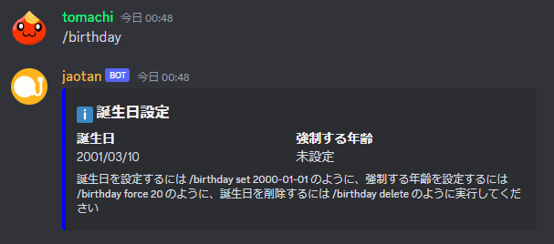
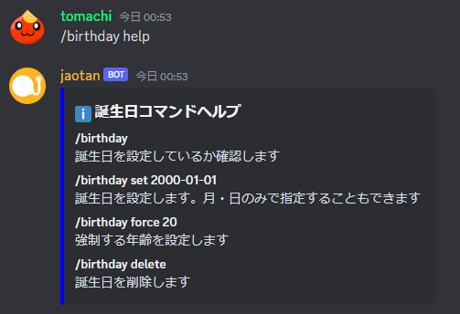

[毎日 `#general` に投稿されるメッセージ](../features/everyday.md) で掲載される、誕生日関連の設定・確認を行えます。

## 使い方

以下のサブコマンドがあります。

- `/birthday`: 設定されている誕生日を表示
- `/birthday set <日付>`: 誕生日を設定
- `/birthday force <年齢>`: 強制する年齢を設定
- `/birthday delete`: 誕生日を削除
- 上記以外: ヘルプを表示

### 設定されている誕生日を表示

`/birthday` と実行すると、以下のように現在設定されている誕生日・強制する年齢を表示します。

### 誕生日を設定

`/birthday set <日付>` と実行すると、誕生日を設定できます。  
`<日付>` には誕生日を入力します。`yyyy/MM/dd` や `yyyy-MM-dd` などの形式で指定できます（例: `/birthday set 2000/01/01`）。  
誕生年は省略できます（例: `/birthday set 01/01`）。誕生年を省略した場合、年齢は表示されなくなります。

強制する年齢を設定した後で誕生日の設定を行うと、強制する年齢の設定は削除されます。

### 強制する年齢を設定

`/birthday force <年齢>` と実行すると、誕生日当日の年齢を上書きできます。  
`<年齢>` には数値を入力します。  
23 歳以上に設定した場合、`#general` で毎日投稿されるメッセージには年齢が掲載されません。

強制する年齢を設定した後で誕生日の設定を行うと、強制する年齢の設定は削除されます。

### 誕生日を削除

`/birthday delete` と実行すると、誕生日設定を削除できます。

### ヘルプを表示

`/birthday help` など、上記以外のサブコマンドで実行すると、以下のようなヘルプが表示されます。

## 必要な権限

誰でも利用できます。

## 関連情報

- [ソースコード](https://github.com/jaoafa/jaotan.ts/blob/master/src/commands/birthday.ts)
